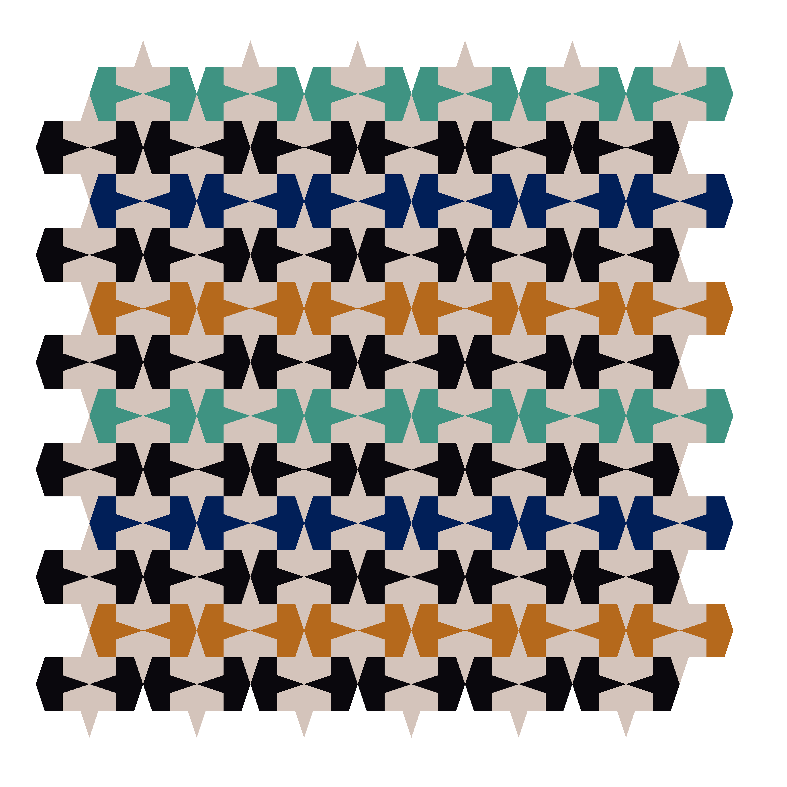
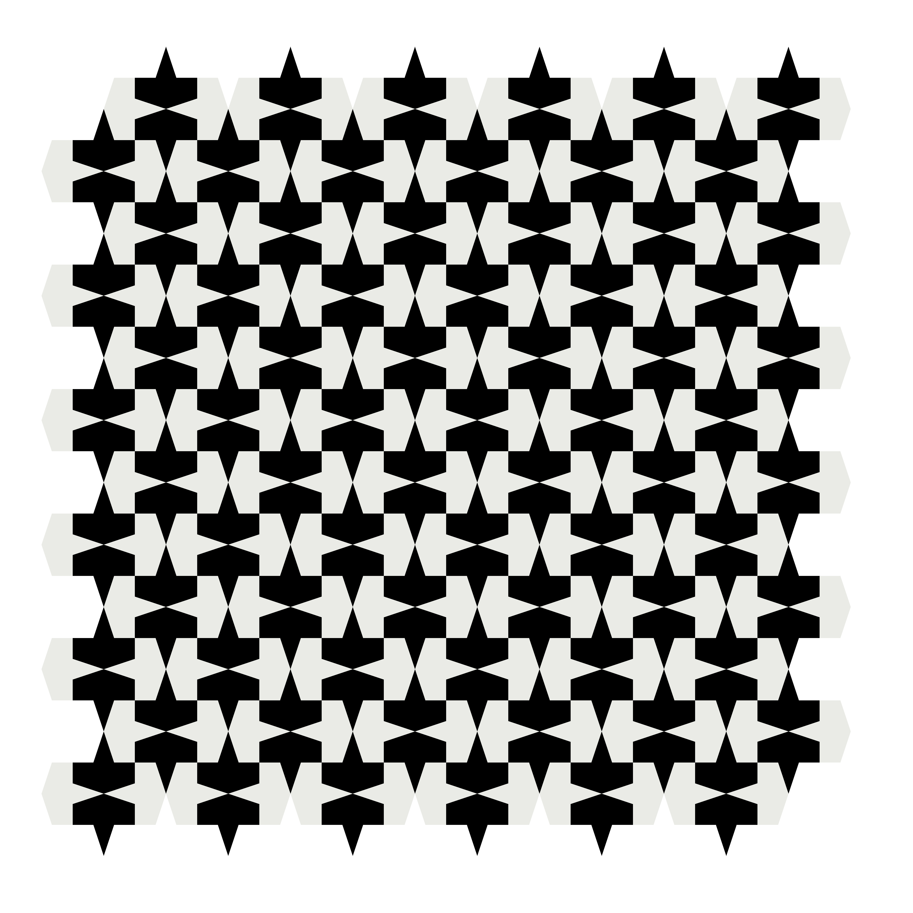
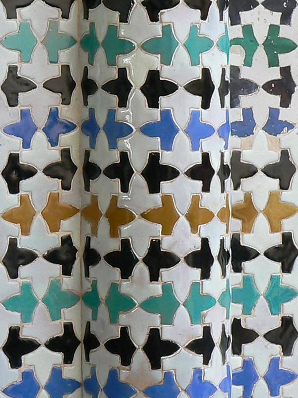
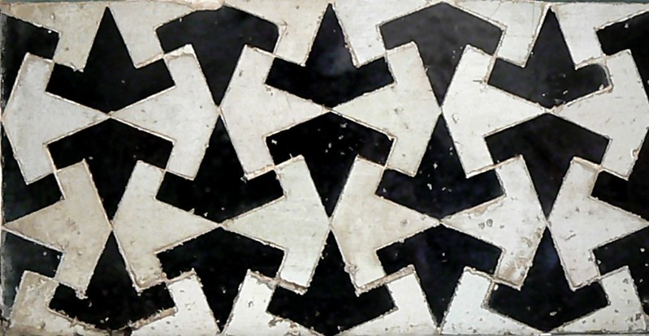

# Tiles

Reproducing "Planes"" tiles located at the Patio of the Gilded Room (Cuarto Dorado)

Alhambra Palace in Granada. UNESCO World Heritage Site, Andalusia - Spain

5 colors             |  2 colors
:-------------------------:|:-------------------------:
 |  

## Original

5 colors             |  2 colors
:-------------------------:|:-------------------------:
 |  

Pictures : https://www.flickr.com/photos/robven/3142025904

## Animation

5 colors             |  2 colors
:-------------------------:|:-------------------------:
 |  

